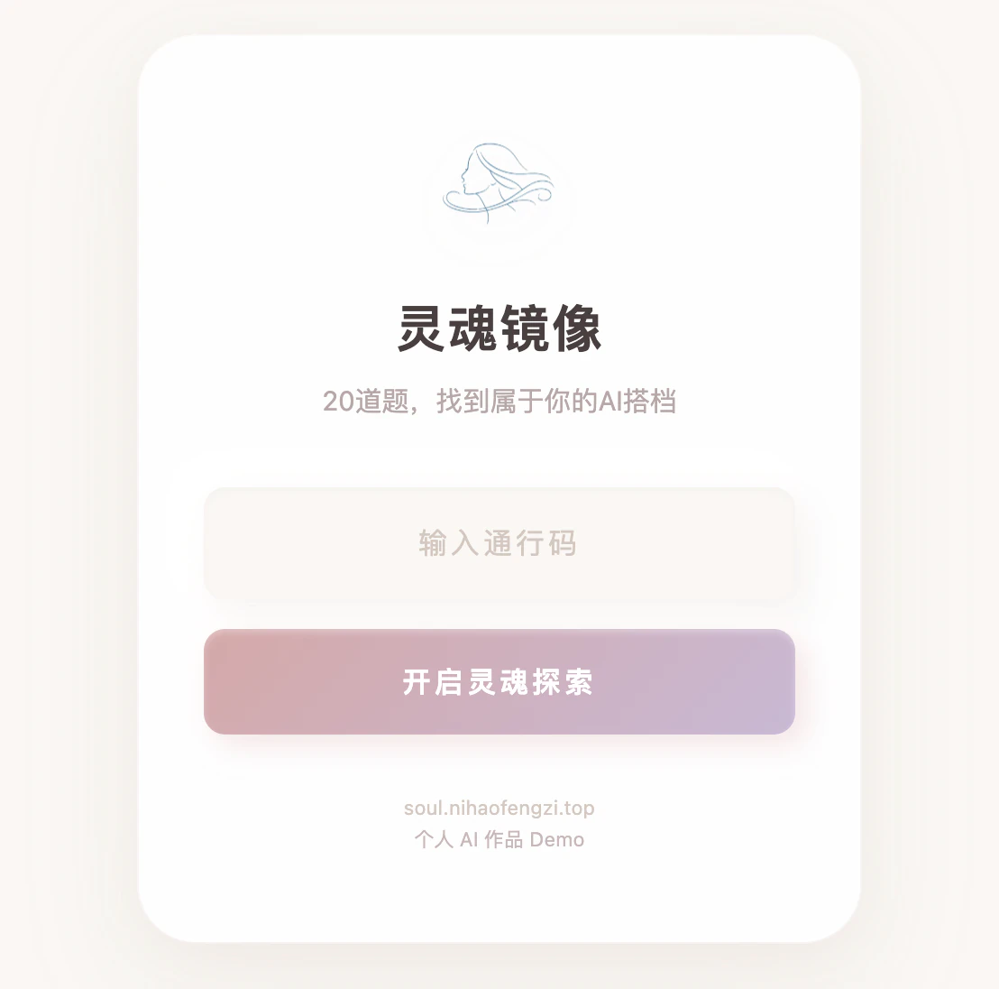
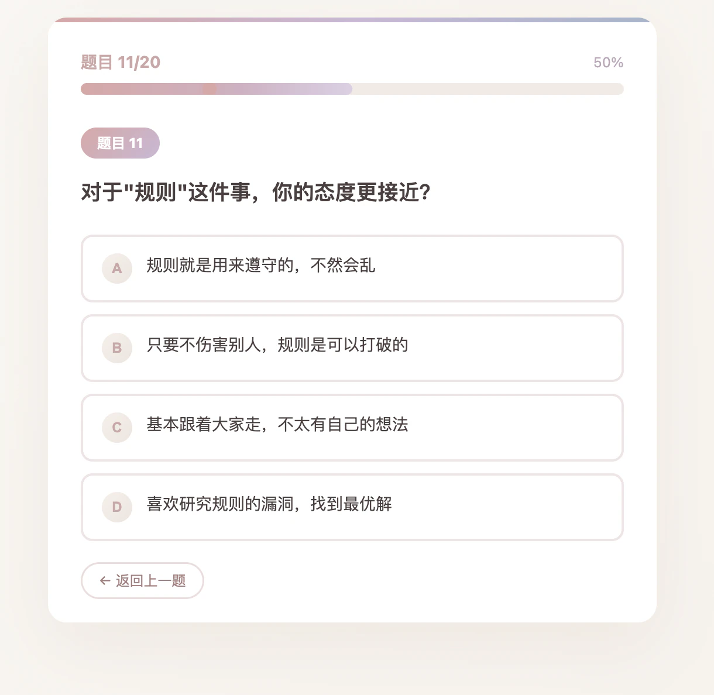
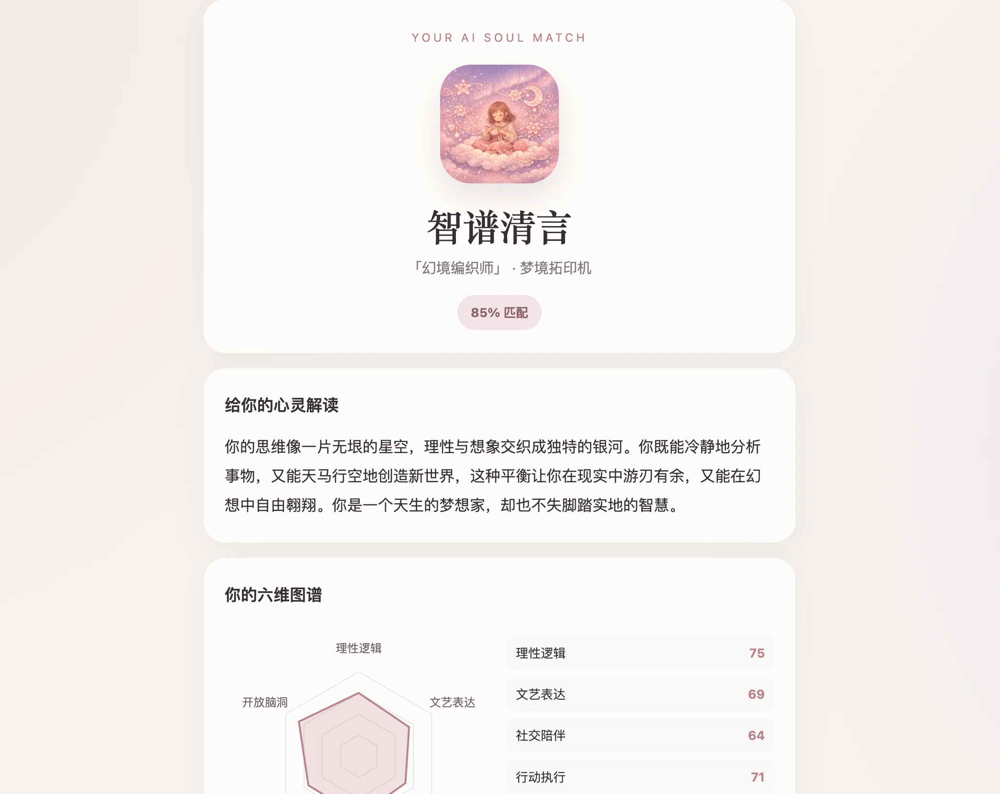
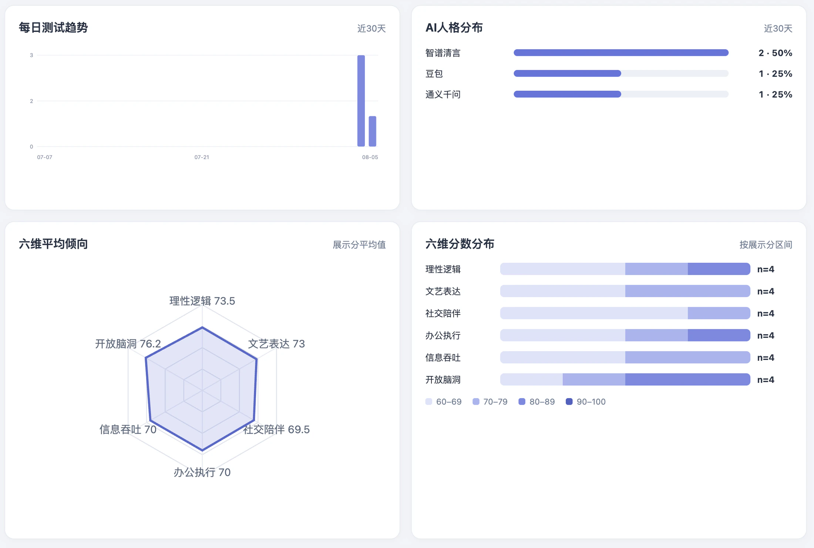
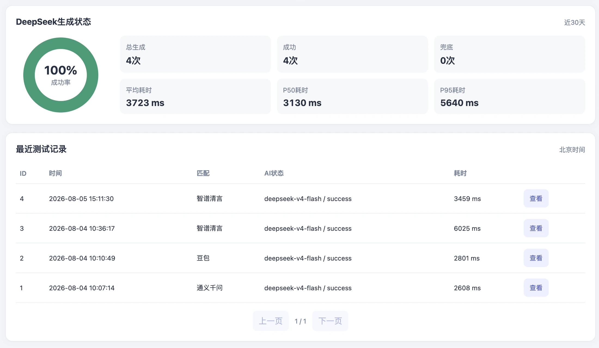

## 项目背景

AIsoul｜灵魂镜像是一个以情绪体验为主导的娱乐性 AI 测试产品。用户完成 20 道题后，系统会计算六维特征，匹配一个具有相近特点的 AI 人格，再生成一份个性化心灵解读。

它不是心理诊断，也不宣称具备专业心理测量效度。产品希望提供的是一次轻量、有趣、具有情绪价值的自我观察体验，让用户通过答题和结果表达重新留意自己的偏好。

入口页：访问者输入统一体验码后，可以开始 20 道题的完整测试流程。

## 用户体验流程

体验码 → 20 道题测试 → 六维评分 → AI 人格匹配 → DeepSeek 生成解读 → 结果页展示

统一体验码只用于个人作品演示，让访问者可以直接进入完整流程；它不被包装成付费机制或正式用户系统。

答题页：通过明确的题号、进度和选项反馈维持连续体验。

## 核心产品判断

- 六维评分和人格匹配由本地确定性逻辑完成，不让大模型直接决定用户属于哪种人格；
- DeepSeek 只根据六维结果和匹配画像生成定制化表达，不接收用户的逐题答案；
- AI 生成失败不会中断测试，每个人格都有独立的本地兜底结果；
- 产品主动删除支付、周通行码、小红书运营和复杂用户系统，把体验收敛到答题、匹配和结果表达；
- 娱乐性测试必须明确能力边界，不能被描述为心理诊断、医疗建议或专业测评。

## DeepSeek API 接入

后端通过 API 调用 DeepSeek，真实 API Key 只保存在服务器环境变量中，不会下发到浏览器，也不会进入 GitHub 仓库。发送给模型的 Prompt 只包含生成解读所必需的六维特征和匹配人格画像，不包含用户的 20 道逐题答案。

模型输出采用约定的 JSON 结构。后端会检查返回字段、数据类型和内容长度，结果页只消费经过校验的安全字段。如果请求超时、出现 HTTP 错误、返回无效 JSON 或结构不符合约定，系统会自动切换到对应人格的本地 fallback，保证用户仍能完成测试并看到完整结果。

这部分接入不只是发起一次模型请求，还包括输入控制、输出契约、密钥安全和失败恢复。

结果页：组合人格匹配、经过校验的生成式解读与六维评分，形成完整反馈。

## 数据收集与统计后台

为了观察产品是否稳定运行，后台匿名保存：

- 测试时间和 `QUIZ_VERSION`；
- 20 道题的选项；
- 六维原始分和展示分；
- 匹配人格与最终结果；
- DeepSeek 模型、成功或 fallback 状态；
- 错误类别和请求耗时。

统计后台可以查看完成测试数量、七个人格分布、DeepSeek 成功率、fallback 次数与比例、平均耗时，以及单次匿名结果详情。

系统不保存姓名、手机号或账号，不保存 IP，数据自动保留 180 天。以下两张后台截图均使用演示数据，只用于说明统计与异常处理能力，不代表线上用户规模。

后台统计概览（演示数据）：用于说明趋势、人格分布和六维统计能力，不代表线上用户规模。

DeepSeek 运行统计（演示数据）：展示生成状态、响应耗时和匿名记录列表，不包含用户身份或逐题答案。

## 我的具体贡献

- 收敛产品定位，明确娱乐性体验与非心理诊断边界；
- 整理体验码、20 道题、六维评分、人格匹配和结果展示流程；
- 维护六维评分过程并梳理人格匹配逻辑；
- 接入 DeepSeek API，设计 JSON 契约和人格独立 fallback；
- 设计 SQLite 匿名数据结构和统计后台；
- 将 API Key、后台密码和 Session 密钥迁移到服务器环境变量；
- 补充 Flask 安全响应头、输入校验和 pytest 自动化测试；
- 整理 GitHub 仓库，完成 Gunicorn、systemd、Nginx 与 HTTPS 部署；
- 清理旧版本、旧服务和不再符合产品定位的功能。

这些工作围绕一个个人 AI 产品从定位收敛到稳定上线的完整过程展开，不将项目包装成成熟商业平台。

## 已完成成果

- 从体验码、答题、评分、匹配到结果展示的完整用户流程已经公开上线；
- DeepSeek 真实 API 已接入，API 失败不会阻塞结果；
- 匿名数据记录和统计后台已经运行；
- 项目具备本地自动化测试、GitHub 版本管理和服务器部署流程；
- 线上入口为 soul.nihaofengzi.top。

## 局限与下一步

项目仍处于上线初期，当前样本量不足以支持人格分布重新校准。题目、六维权重和人格画像属于娱乐性产品设计，不具备专业心理测量效度。

后续会在样本量足够后检查人格分布和题目偏差，并结合 DeepSeek 成功率、请求耗时和真实反馈继续精简结果页。优化重点是提高表达和体验质量，而不是增加功能数量。
