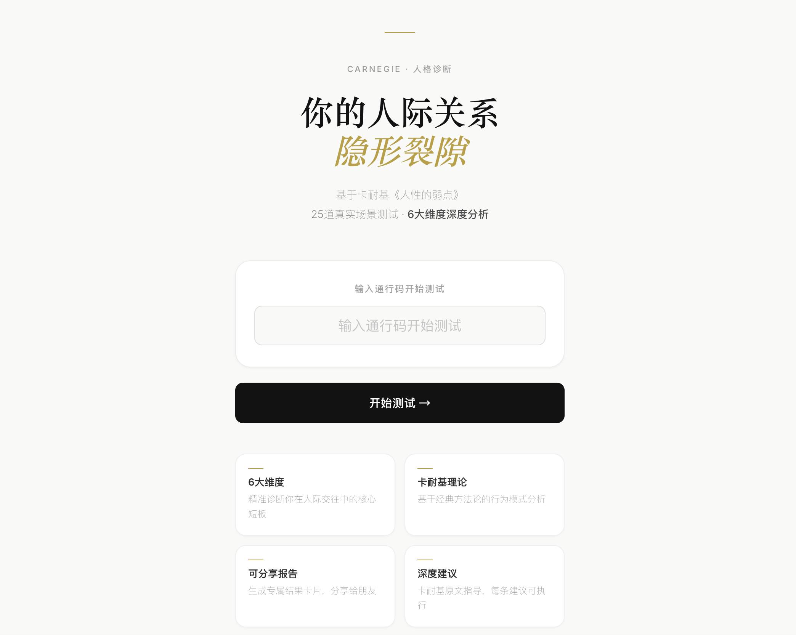
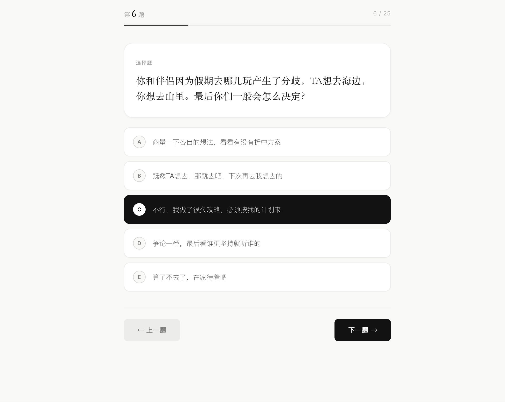
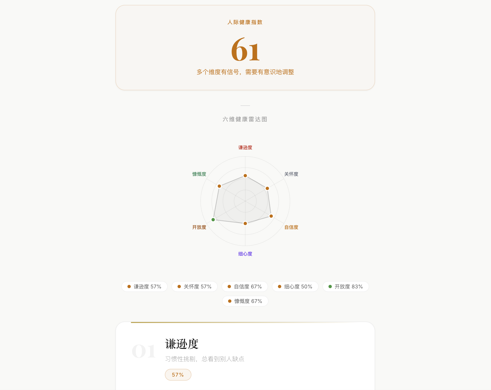

## 项目背景

在日常社交中，人们经常通过性格测试、兴趣测试了解自己，但这些测试往往停留在结果获取，很少进一步帮助用户理解自身在人际关系中的行为模式。

GAP 希望通过一个轻量化互动体验，让用户在完成测试的过程中重新观察自己的关系倾向，并将测试结果转化为一次自我思考的入口。

## 核心判断

- 测试产品的价值不是给用户贴标签，而是提供一个重新认识自己的观察工具；
- 用户完成测试的过程本身就是体验的一部分，需要保持流程清晰和反馈连续；
- 结果展示需要保持克制，避免将娱乐测试包装成心理诊断。

## 我的具体贡献

我负责 GAP 从概念到上线的完整流程，包括产品定位、测试流程设计、结果反馈逻辑设计以及前端页面实现。

在开发完成后，我独立完成项目部署与线上环境配置，使产品具备真实访问能力。

## 过程与方法

我围绕用户进入测试、完成答题、获得反馈三个核心阶段设计体验流程，并持续优化页面信息层级、交互反馈和结果呈现方式。

## 已完成成果

- 完成可公开访问的线上产品；
- 实现从测试入口、答题流程到结果反馈的完整用户体验；
- 完成独立开发、部署和线上运行。

## 限制与未完成

互动测试不能替代专业评估，题目设计和结果表达仍需要结合真实使用反馈继续校准。项目当前不宣称用户规模或商业成果。

## 反思与下一步

产品上线只是验证的开始。后续需要结合真实用户反馈，持续优化测试内容、结果表达以及用户体验流程。
