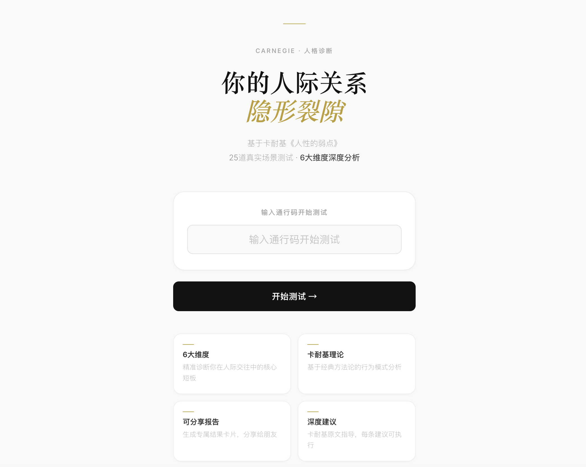
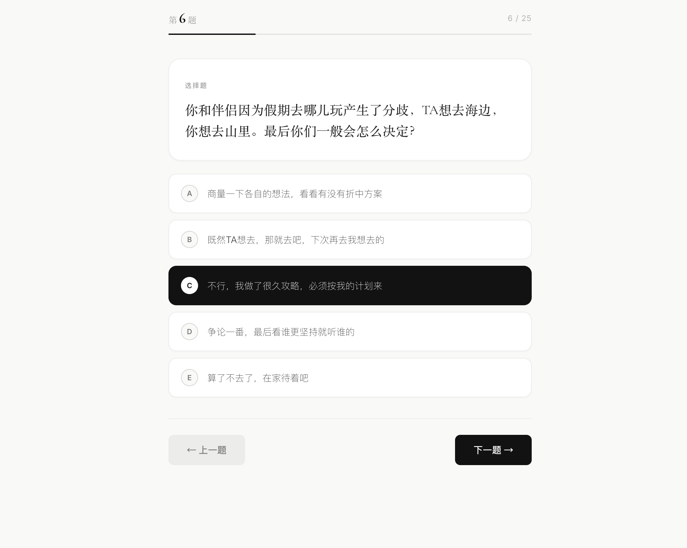
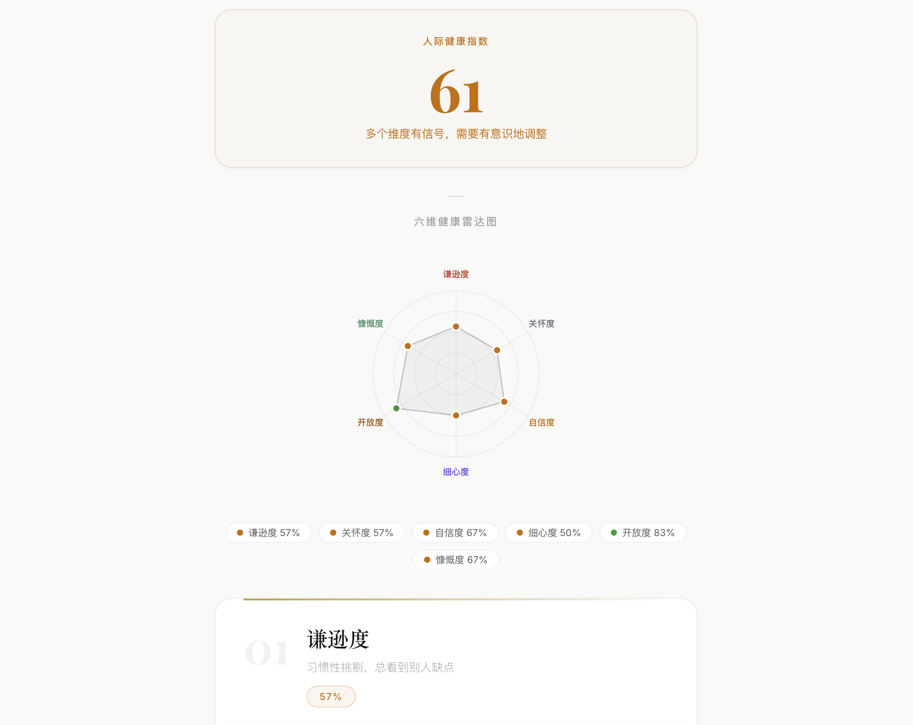

GAP 是一个围绕人际关系行为设计的互动测试产品。

用户需要完成 25 道发生在职场、校园和日常生活中的场景题。系统会从六个维度整理用户的选择，生成一份包含整体倾向、主要关系盲点、具体分析和行动建议的结果报告。

它不试图判断一个人的性格好坏，也不能替代专业心理评估。它想提供的是一次更具体的自我观察：当批评、分歧、倾听、求助或关系交换真正发生时，我通常会怎样反应？

## 项目从哪里开始

GAP 的灵感来自戴尔·卡耐基的《人性的弱点》。

书中包含大量关于批评、倾听、记住他人、处理争论和关注他人需求的原则。但在阅读时，我发现一个问题：

**理解一个道理，并不意味着能够意识到自己在真实关系中是怎样行动的。**

“不要随意批评别人”是一句容易理解的话。但当同事指出自己的错误、朋友获得了比自己更好的结果，或者家人在反复谈论一个令人不耐烦的话题时，人真正做出的反应往往没有那么理想。

因此，我没有把产品做成知识问答，而是尝试把这些抽象原则放回具体情境，让用户通过自己的选择观察关系模式。

首页：以关系情境和完整测试入口说明产品的自我观察定位。

## 从一本书到六个观察维度

我首先从《人性的弱点》中整理出六类经常影响人际连接的行为倾向：

- 容易批评和挑剔他人；
- 忽视他人的情绪与感受；
- 在对话中过度关注自己；
- 记不住他人的名字和重要信息；
- 面对不同意见时迅速进入防御；
- 将关系理解为付出与回报的交换。

在题目设计阶段，这六类倾向用于整理和计算用户的选择。

但在结果页中，我没有直接把用户定义成“批评型”“冷漠型”或“索取型”，而是将六个结果转换为：

**谦逊度、关怀度、自信度、细心度、开放度和慷慨度。**

这样做不是为了美化结果，而是为了让反馈指向一种可以继续培养的能力，而不是给用户贴上一个固定标签。

## 25 道题是如何设计的

测试由两种题型组成：

**19 道场景选择题**

题目覆盖职场、校园和生活关系。用户需要在几个具有不同反应倾向的选项中，选择更接近自己真实行为的一项。

例如：

- 同事当众指出你的报告存在错误；
- 朋友向你分享升职的好消息；
- 室友影响了你的复习；
- 很久没有联系的朋友重新出现在微信中；
- 伴侣和你对假期安排产生分歧。

与直接询问“你是否关心别人”相比，具体场景更容易让用户回忆自己的真实反应，也能减少用户选择一个明显“正确答案”的冲动。

**6 道七级量表题**

最后六道题分别对应一个维度，用户需要判断某种行为描述与自己的符合程度。

量表题用于补充前面场景选择题的信息，使每个维度都获得一次更直接的自我判断。

题目并不是一次完成后便固定不变。我先后调整过场景、选项区分度、题目措辞和维度映射，尽量减少多个选项含义重叠，以及用户无法判断差异的问题。

答题页：单题呈现场景与选项，并持续显示题号、进度和选择状态。

## 我在结果页中做出的设计判断

结果页不是只给出一个总分。

完成测试后，用户会依次看到：

- 整体人际健康指数；
- 六维结果图谱；
- 当前最需要注意的关系倾向；
- 这一倾向可能形成的原因；
- 它可能如何影响真实关系；
- 三项可以尝试的具体行动；
- 其他五个维度的展开说明；
- 当前表现相对稳定的“安全区”；
- 延伸阅读内容。

我希望结果能够完成三个层次的反馈：

**先让用户看见结果，再帮助用户理解结果，最后给出一个可以开始改变的动作。**

因此，结果页没有停留在“你是哪一种人”，而是继续回答：

- 这种倾向可能在什么情况下出现？
- 它会怎样影响别人对我的感受？
- 下一次遇到类似场景时，我可以怎样做得不一样？

结果页：通过综合指数、六维图谱和分层分析，把观察结果连接到具体行动。

## 为什么没有加入生成式 AI

GAP 的题目、维度计算和结果内容全部由预先设计的规则完成，没有通过大模型临时生成判断。

这是一个主动选择。

这个项目的重点是研究如何把内容原则转化为题目、规则和反馈，而不是让模型根据答案自由解释用户。

确定性的内容结构也让我能够逐题检查：

- 每个选项对应什么行为；
- 它应该影响哪个维度；
- 不同用户为什么会得到不同结果；
- 结果中的每一段表达来自哪里。

与 AIsoul 相比，GAP 展示的是另一种产品方法：不依赖生成式能力，而是通过内容设计和规则系统形成完整体验。

## 视觉与交互设计

GAP 采用暖白背景、衬线标题、黑灰正文和少量金色点缀，形成接近编辑出版物的视觉风格。

我没有使用常见测试产品中大量的渐变、表情符号和强烈色彩，而是希望用户把注意力放在题目和结果文字上。

答题页保持单题展示，并持续显示：

- 当前题号；
- 总题数；
- 完成进度；
- 已选择状态；
- 上一题和下一题操作。

结果页则通过数字、雷达图、分层卡片和可展开内容组织较长的分析，避免一次展示过多文字。

项目也针对移动端进行了单独调整，包括标题缩放、选项间距、量表按钮、结果卡片和雷达图图例，使完整测试可以在手机上连续完成。

## 从首版到当前版本

GAP 并不是一次完成的静态页面。

在制作过程中，我先后调整了：

- 产品名称和整体定位；
- 六个维度的命名方式；
- 题目数量、场景与选项；
- 选择题和量表题的组合；
- 结果页的评分呈现；
- 六维雷达图和折叠卡片；
- 行动建议和延伸阅读；
- 首页、答题页和结果页的视觉系统；
- 手机端的响应式体验；
- 通行码、数据记录和运行后台。

项目最初更强调“发现弱点”，后续逐渐调整为“观察关系能力”。

这种变化也反映了我对产品表达的重新判断：制造焦虑可以让标题更有吸引力，但长期来看，只有让结果保持克制、清楚并且可以行动，产品才真正对用户有价值。

## 技术实现

项目使用 Flask、SQLite 和原生 HTML、CSS、JavaScript 构建。

我完成了：

- 首页与通行码验证；
- 25 道题的连续答题流程；
- 六个维度的结果计算；
- 综合指数和雷达图展示；
- 维度分析、行动建议与延伸阅读；
- 测试记录和运行统计页面；
- 移动端响应式适配；
- Gunicorn 与服务器部署；
- 独立域名和线上运行环境配置。

项目没有使用大型前端框架。页面结构、交互和结果图表均使用原生前端技术实现。

## 我的具体贡献

在 GAP 中，我负责了从概念到上线的完整过程，包括：

- 从《人性的弱点》中提炼产品主题；
- 将人际原则整理为六个观察维度；
- 设计并迭代 25 道场景题和量表题；
- 制定维度映射和结果分级方式；
- 设计首页、答题页和结果页的信息结构；
- 编写六个维度的解释、影响与行动建议；
- 完成前端页面和 Flask 后端开发；
- 增加测试记录、通行码和统计功能；
- 处理移动端适配与视觉重构；
- 完成服务器部署和线上维护。

这个项目让我实践的核心并不是“做一个测试页面”，而是如何把一组抽象内容转化为一条可以被真实体验的产品流程。

## 当前成果

目前，GAP 已经完成并公开上线：

- 用户可以连续完成全部 25 道题；
- 产品具备完整的入口、答题和结果流程；
- 结果页能够展示综合反馈和六维分析；
- 页面已经适配桌面端与移动端；
- 项目具备后端服务、数据记录和线上部署环境。

线上地址：

**gap.nihaofengzi.top**

## 局限与下一步

GAP 是一个个人设计的自我观察产品，不具备专业心理测量效度，也不能用于心理诊断、人员筛选或关系决策。

当前题目与维度主要来自内容提炼和产品设计，仍需要更多真实使用反馈来检查：

- 部分选项是否过于明显；
- 不同选项之间是否存在语义重叠；
- 六个维度的题目数量是否均衡；
- 个别题目是否对最终结果影响过大；
- 结果表达是否会让用户感到被评判；
- 行动建议是否足够具体和可执行。

下一阶段不会优先增加更多功能，而是先统一题库与评分实现，继续调整题目质量，并降低“诊断”“致命弱点”等过强表达。

对 GAP 而言，真正需要继续打磨的不是页面数量，而是从一道题、一个选项到最终反馈之间的逻辑是否清楚、可信并且一致。
