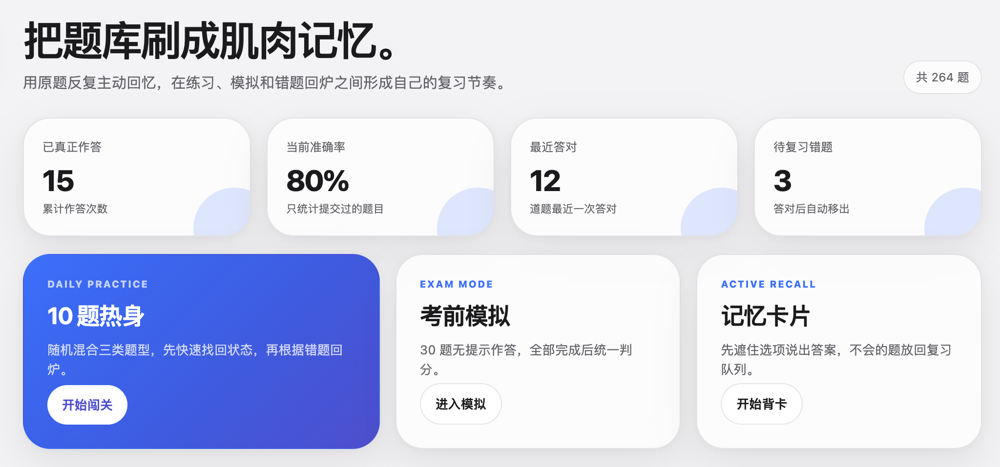
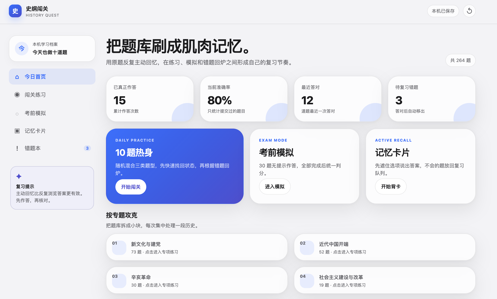
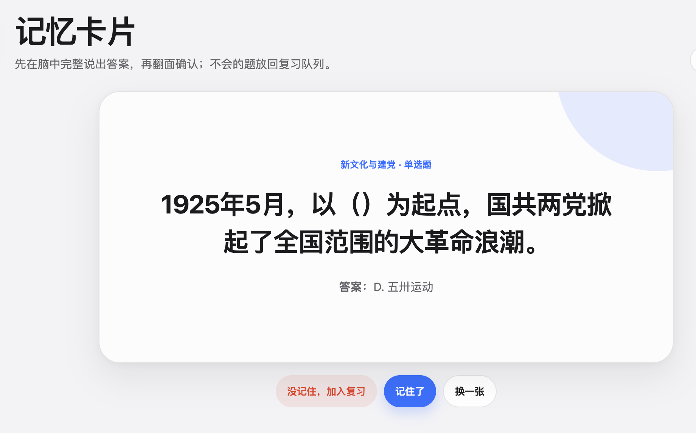
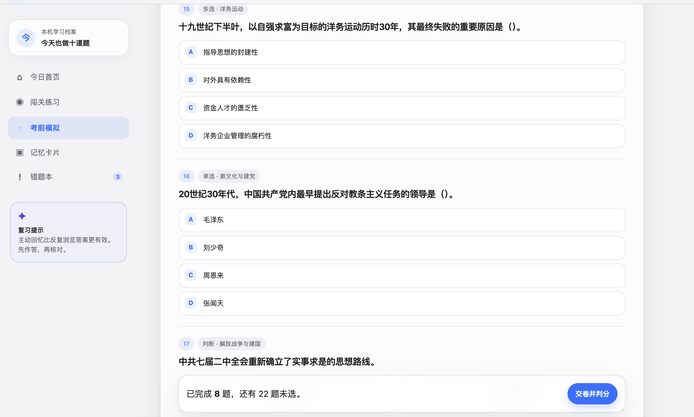
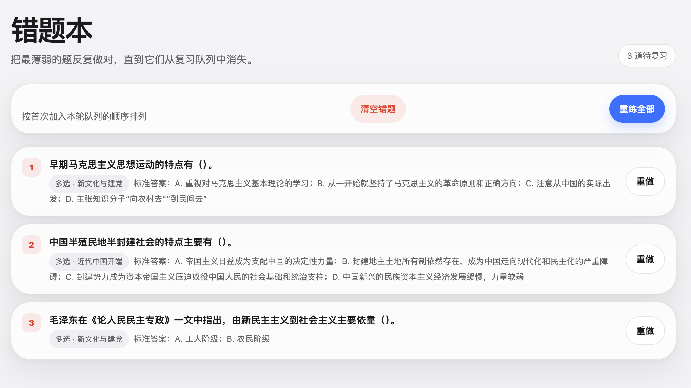

史纲闯关面向《中国近现代史纲要》期末复习，将 264 道原题重新组织为闯关练习、考前模拟、记忆卡片和错题回炉，让复习从反复浏览答案，转变为持续的主动回忆。

它最初只是我为自己制作的备考工具。项目完成后，我将网站分享给一些同学使用，也收到了较多正向反馈。在最终考试中，我的《中国近现代史纲要》课程取得了 **97 分**。

项目首页：以 264 道原题为基础，提供闯关练习、考前模拟和记忆卡片三种主要复习入口。

## 项目从一次真实的期末复习开始

准备《中国近现代史纲要》期末考试时，我已经拿到了一份包含数百道原题的复习资料。

题目并不缺，真正的问题是怎样把它们记住。

在文档里反复翻看题目和答案，很容易产生一种错觉：因为这道题看起来熟悉，所以自己应该已经掌握了。但当答案被遮住，或者选项顺序发生变化时，我未必还能独立选出正确答案。

做错的题也散落在长文档中。第二次复习时，我需要重新寻找，既不知道自己做过多少题，也很难判断哪些内容仍然薄弱。

于是，我决定先为自己制作一个能够直接刷题的网站。

它不需要复杂的账号系统，也不追求成为一个完整的在线教育平台。最初的目标很具体：打开网页以后，可以马上做题；做错的题能够留下来；下一次复习时，优先处理尚未掌握的内容。

首页既是功能入口，也是一张保存在本机的学习档案。截图中的次数与正确率为功能演示数据，不代表公开用户规模。

## 不是把题库搬到网页，而是重新组织复习

制作过程中，我首先确定了一条规则：

**必须先作答，再看答案。**

只有真正选择并提交过的题目，才会进入作答次数和正确率统计。直接查看答案或跳过题目，不会被记录为一次正式作答。

这样做是为了区分两种状态：

一种是看到答案后感到熟悉；另一种是在没有提示时，仍然能够主动回忆并做出选择。

史纲闯关希望训练的是后者。

因此，我没有把项目做成一份可以翻页浏览的电子题库，而是围绕“作答、反馈、发现错误、再次练习”设计了完整流程。

用户可以先进行一轮 10 道题的快速热身，也可以按照题型、历史专题和题量进行集中练习。每道题提交后立即判断正误，多选题只有在选全正确选项且没有多选时才算答对。

首页则持续记录累计作答次数、当前准确率、最近答对的题目和仍在复习队列中的错题，让复习进度不再只依赖主观感觉。

## 把主动回忆做成一个具体动作

记忆卡片是产品中最直接体现主动回忆原则的功能。

页面会先隐藏选项，只呈现题目。用户需要先在脑中完整说出答案，再翻面确认，并判断自己是否真正记住。

如果没有记住，这道题会被放回复习队列；如果已经能够正确回忆，则继续下一张。

相比直接看着选项进行识别，这种方式会更困难一些，但也更接近考试时真正需要完成的回忆过程。

先在脑中说出答案，再翻面核对。不会的题重新进入复习队列，而不是在看过答案后被默认掌握。

## 练习、模拟和错题回炉

日常练习和正式考试需要的是两种不同状态。

练习模式允许用户逐题提交并立即获得反馈，适合学习和纠正；考前模拟则不会在答题过程中显示答案，而是随机生成一套包含单选、多选和辨析题的 30 题试卷，完成后统一交卷、判分并逐题核对。

这样设计，是为了避免用户在练习时一直处于考试压力中，也避免在模拟时依赖即时反馈。

模拟模式统一组卷、统一交卷，作答过程中不提供答案提示。错误和未作答题目会在交卷后进入错题本。

错误题目会自动进入错题本，但错题本并不是一个长期保存失败记录的收藏夹。

用户可以单独重做某一道题，也可以重练当前全部错题。只要再次正式作答正确，这道题就会自动离开复习队列。

我希望错题本表达的不是“你曾经错过什么”，而是“现在还有什么没有真正掌握”。

错题会自动进入复习队列，重新答对后自动移出。队列中的题目会随着复习不断减少。

## 从一个能用的单文件，到可以继续维护的项目

史纲闯关的第一版非常直接。

为了尽快投入复习，我把题库、页面、样式和交互全部放进一个约 176 KB 的 HTML 文件中。这个版本已经能够完成基本刷题，也确实进入了我和同学的复习过程。

但随着功能增加，单文件结构的问题逐渐显现：题库与页面逻辑混在一起，练习、模拟和错题功能难以复用，修改一处代码也可能影响其他流程。

考试结束后，我没有把它留在“能用就行”的状态，而是保留原始版本，同时将项目重构为 React 和 TypeScript 应用。

新的结构将题库数据、抽题与判分规则、学习进度、页面功能和界面组件分别管理。重构的目的不是单纯更换技术框架，而是让题库可以检查、逻辑可以测试、数据可以迁移，项目也能够继续维护。

## 题库整理与工程边界

原始版本包含 265 条题目数据。迁移过程中，我发现其中两道题内容和答案相同，只是选项顺序不同。合并重复项后，当前题库共保留 264 道唯一题目。

项目增加了构建前的数据校验，用于检查题目编号、必要字段、题型、答案范围和重复题干，避免一次题库修改引入难以察觉的错误。

对于题目中的历史事实和标准答案，我也保留了明确边界。

由于原始教师答案文档目前不在仓库中，这次整理只处理能够确认的数据结构和重复问题，没有根据个人判断擅自修改事实性内容。未来补充教材或教师标准答案后，内容校对会作为独立阶段进行。

## 为什么学习记录保存在本机

当前版本不要求登录，所有作答次数、正确率、错题和记忆卡片状态都保存在用户当前浏览器中，也不会被发送到服务器。

这降低了使用门槛。同学打开链接后不需要注册、设置密码或建立账户，就可以直接开始复习。

项目重构后，新版本还会自动读取并迁移旧版学习记录，包括作答次数、错题状态和卡片记录，尽量避免已有使用者重新开始。

本机存储也有明显限制：更换设备或清理浏览器数据后，记录无法自动同步。因此，我不会将它描述为一个完整的学习管理平台，而是一款低门槛、无需登录、能够独立运行的复习工具。

## 实际使用与结果

史纲闯关首先解决的是我自己的期末复习问题。

我使用它反复完成原题练习、错题回炉和考前模拟，最终《中国近现代史纲要》课程取得了 **97 分**。项目随后也被分享给一些同学使用，并收到了较多正向反馈。

当然，不能把一次考试成绩完全归因于一个工具。成绩同样来自课程学习、资料整理和实际投入的复习时间。

但这段经历至少验证了一点：史纲闯关并不是一个只用于展示的界面原型。它来自真实问题，进入了真实的复习过程，也帮助我形成了一套能够持续执行的备考节奏。

项目最有价值的地方，不只是我完成了一个刷题网站，而是它经历了一条相对完整的路径：

**从自己的问题出发，做出可以立即使用的工具，将它分享给身边的人，再在实际使用后重新整理和工程化。**

## 当前成果与局限

史纲闯关目前已经完成 264 道题的结构化整理，并形成了专项练习、考前模拟、记忆卡片和错题回炉四条相互连接的复习路径。

项目已经适配桌面端和移动端，具备本机进度保存、旧数据迁移、题库校验、自动化测试以及独立域名和 HTTPS 部署。

它的边界同样清晰：项目仍然围绕一门特定课程和一份特定题库设计；学习记录不能跨设备同步；部分辨析题解析仍不够完整；题库内容也需要在获得原始资料后继续核验。

因此，下一步不应为了让项目显得更复杂而不断增加功能。

更合理的方向，是先继续提高题库和解析质量，再根据是否存在新的真实使用需求，决定是否增加数据导出、跨设备同步或间隔复习。

这个项目已经完成了它最初的使命，也让我第一次清晰地体会到：一个项目不一定从宏大的产品设想开始，它也可以从“我现在确实需要一个更好用的工具”开始。
